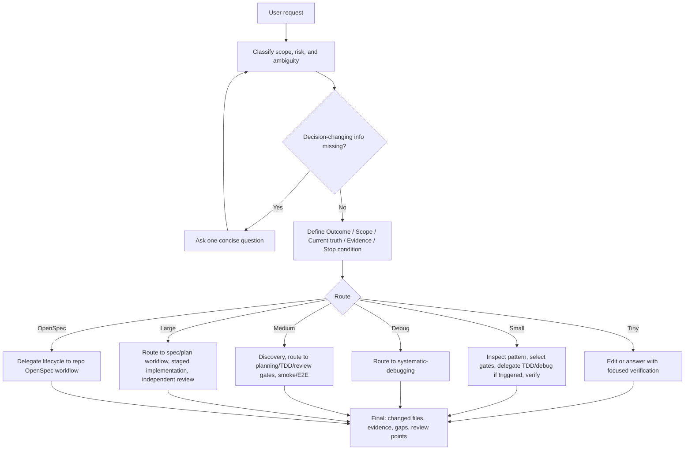

# Adaptive Dev Workflow

Risk-adaptive workflow router for agentic coding.

Adaptive Dev Workflow 是一个面向 Codex、Claude Code、Gemini CLI 等 AI coding agent 的轻量路由 skill。它不替代 Superpowers、OpenSpec、测试、CI 或 human review。它的职责是让 agent 在开始软件任务时先判断风险，然后选择刚好足够的 gate，并把具体执行交给更专业的 workflow skill。

核心目标：

- 小任务保持快，不把 README typo 变成完整 spec 流程。
- 高风险任务保持稳，不让权限、数据模型、API、部署配置只靠 happy path 验收。
- 让 agent 在编码前显式说清 Outcome、Scope、Current truth、Evidence 和 Stop condition。
- 把 planning、TDD、debugging、verification、review、OpenSpec 等能力组合成一个统一入口，但不重写它们的内部纪律。

## Why

Agentic coding 最常见的问题不是 agent 不会写代码，而是它会隐式做产品、架构、范围和验收决策：

- 需求还没澄清就开始改。
- 小修复扩成无关重构。
- 行为改了但没有 regression evidence。
- CI 或生产类问题凭直觉修，没有先复现和定位。
- 最终回复声称完成，但没有 fresh verification。
- `AGENTS.md` / `CLAUDE.md` 写了很多规则，agent 仍然不知道当前任务该走轻流程还是重流程。

这个 skill 的设计点是：**用风险决定流程强度，而不是对所有任务套同一套仪式。**

## What It Is

`adaptive-dev-workflow` 是一个 coordinator skill：

- 根据任务选择 Tiny / Small / Debug / Medium / Large / OpenSpec。
- 决定是否需要 goal clarification、brainstorming、writing-plans、TDD、systematic-debugging、verification、independent review。
- 要求每个任务都定义 evidence，但允许 Tiny / mechanical change 使用最小 validator。
- 一旦路由到 TDD、debugging、planning、verification 或 review，继承对应 skill 的更强规则，而不是降级执行。
- 在改变 scope、public API、data model、security posture、user-facing behavior、依赖、部署或长期架构路线前暂停让人决策。
- 将复杂证据矩阵和 skill validation protocol 放到 reference 文件，保持 `SKILL.md` 精简。

它不是：

- 代码正确性的保证。
- human review 的替代品。
- 每个任务都必须执行的重型 SDD 流程。
- productivity benchmark。
- 可以替代 tests、CI、observability 或 release discipline 的 prompt。

## Install

Clone this repository:

```sh
git clone https://github.com/BlueWhalexh/Adaptive-dev-skill.git
cd Adaptive-dev-skill
```

Install for Codex:

```sh
mkdir -p ~/.codex/skills/adaptive-dev-workflow
rsync -a skills/adaptive-dev-workflow/ ~/.codex/skills/adaptive-dev-workflow/
```

Optional install for an `.agents` skill directory:

```sh
mkdir -p ~/.agents/skills/adaptive-dev-workflow
rsync -a skills/adaptive-dev-workflow/ ~/.agents/skills/adaptive-dev-workflow/
```

The installable skill lives at:

```text
skills/adaptive-dev-workflow/
├── SKILL.md
├── agents/openai.yaml
└── references/evidence-and-validation.md
```

Do not put project-specific rules into the skill. Put those in the target repository's `AGENTS.md`, `CLAUDE.md`, docs, hooks, scripts, or CI.

## Use

Direct invocation:

```text
Use $adaptive-dev-workflow.
Add status filtering to the order page. Preserve the current API unless a change is necessary.
```

Implicit project rule for `AGENTS.md`:

```md
For implementation, fix, refactor, design, planning, verification, or review tasks, use adaptive-dev-workflow.
Choose Tiny/Small/Debug/Medium/Large/OpenSpec based on ambiguity, blast radius, and verification risk.
Do not claim completion without fresh evidence.
```

For Claude Code or tools without native skill loading, use the same policy in `CLAUDE.md` or project memory, and link to `skills/adaptive-dev-workflow/SKILL.md` as the workflow source.

## Relationship To Superpowers

This project is designed to sit above Superpowers, not replace it.

```text
Adaptive Dev Workflow = Router + Gate Selector + Scope Guard
Superpowers = Discipline Executor
OpenSpec = Spec Lifecycle Executor
Project AGENTS.md / CLAUDE.md = Repo-specific Constraints
CI / hooks / tests = Mechanical Enforcement
```

When a stronger skill is selected, this router must not weaken it:

- Debug route uses `systematic-debugging`: no fix before root-cause investigation.
- TDD route uses `test-driven-development` / `superpowers:test-driven-development`: no production behavior change before valid Red evidence when the behavior is automatable.
- Plan/spec gate uses `writing-plans`, `superpowers:writing-plans`, or `openspec-workflow` when available.
- Completion gate uses `verification-before-completion`: no success claim without fresh evidence.
- Review gate uses `requesting-code-review` or an isolated review pass for high-risk or broad changes.

The router may decide that a Tiny or mechanical task does not need TDD. It should not decide to run a weaker version of TDD after selecting the TDD gate.

## Workflow



## Route Table

| Route | Use when | Evidence expectation |
| --- | --- | --- |
| Tiny | Text/docs/config typo, single obvious fix, no runtime blast radius | Diff review, command/link check only if semantics matter |
| Small | Narrow behavior change or single-file bugfix | Focused validator; route to TDD/debug when behavior or root cause risk justifies it |
| Debug | CI/test failure, regression, production-like failure, unexplained behavior | Use systematic debugging; reproduce and isolate root cause before fixes |
| Medium | 1-3 modules, new behavior/API, meaningful edge cases | Route to brainstorming/planning/TDD as triggered; add smoke/E2E when a chain matters |
| Large | Cross-module feature, migration, auth/security/data-model/user workflow | Route to spec/plan workflow, docs handoff, independent review, system verification |
| OpenSpec | Repository already uses OpenSpec and the workflow is available | Delegate lifecycle to the repo's OpenSpec process |

Escalate the route when the task touches public API, auth, permissions, secrets, payments, PII, data model, runtime/deploy/environment config, availability, performance, cross-service workflow, migration, concurrency, or state-machine behavior.

## Testing And Verification

This skill uses evidence before claims:

- Tiny/mechanical: smallest validator that proves the claim.
- Small bug/behavior: reproduce or define focused validator before implementation; automate regression when feasible.
- Medium feature/API/UI: focused tests plus smoke/E2E when a user-visible or system-visible chain matters.
- Large/high-risk: staged tests, independent review, system verification, and docs handoff.

Red evidence is right-sized:

- Every task must define evidence before implementation, but not every task needs Red.
- Route to TDD when the project has a suitable harness and changed behavior can be captured at reasonable cost.
- Prefer TDD for automatable bugs, core logic, API contracts, permissions, data, and state machines.
- Once TDD is selected, follow the selected TDD skill's Red-Green-Refactor process; do not substitute an ad hoc weaker version.
- Use alternate validators for Tiny/mechanical changes, visual-only checks, unavailable test environments, or cases where automation cost exceeds risk.
- Never treat "no TDD" as "no evidence".

## Documentation Model

The skill treats docs as a way to reduce future action space, not as decoration:

| Doc surface | Purpose |
| --- | --- |
| `AGENTS.md` / `CLAUDE.md` | Durable repo rules, commands, gotchas, review expectations |
| `docs/canonical/` | Current truth for architecture, contracts, state machines, invariants |
| `docs/specs/design/` | Approved design and tradeoffs for Medium/Large work |
| `docs/specs/plans/` | Staged implementation plan and evidence per task |
| `docs/specs/changes/` | Dated requirement deltas after approval |
| `docs/reference/` | Historical or external background, not current truth |
| Tests | Executable behavior docs |
| Final/PR summary | Delivery handoff |

Use those paths only when the target repo follows this convention. Otherwise follow the repo's existing docs structure.

## Skill Validation

Validate changes to this skill with behavior evals, not just static reading:

- Static check: frontmatter, `agents/openai.yaml`, reference paths, duplicate installed versions.
- Route dry run: route representative prompts and compare expected route/evidence.
- Blind subagent eval: give only `SKILL.md` and pressure prompts to a fresh reviewer.
- Developer/Auditor simulation: one session executes, another reviews only output, diff, and evidence.

Seed prompts are documented in `skills/adaptive-dev-workflow/references/evidence-and-validation.md`.

## Examples

Tiny:

```text
Use $adaptive-dev-workflow.
Fix the install command in README.md. Verify the command text is consistent with the repo layout.
```

Small:

```text
Use $adaptive-dev-workflow.
Fix the login button not submitting. Reproduce or add a focused validator before changing implementation.
```

Debug:

```text
Use $adaptive-dev-workflow.
CI is failing on the auth tests. Read the failure, reproduce locally if possible, isolate the cause, then fix.
```

Medium:

```text
Use $adaptive-dev-workflow.
Add status filtering to the order page. Confirm UX/API boundaries, add focused tests, and run a browser or E2E smoke check.
```

Large:

```text
Use $adaptive-dev-workflow.
Refactor the permission model from role-based checks to policy checks. Stop before implementation if the API or data model must change.
```

Review-only:

```text
Use $adaptive-dev-workflow.
Review this PR for correctness, scope creep, evidence gaps, security risk, and completion claims. Do not edit files.
```

## Repository Layout

```text
.
├── skills/adaptive-dev-workflow/   # installable skill source
│   ├── SKILL.md
│   ├── agents/openai.yaml
│   └── references/evidence-and-validation.md
├── docs/                           # background essays and design notes
├── examples/                       # AGENTS.md / CLAUDE.md templates and request examples
├── CONTRIBUTING.md
├── LICENSE
└── README.md
```

## Design Sources

This project follows these public design constraints:

- [OpenAI Codex skills](https://developers.openai.com/codex/skills): skills should be concise, focused, and progressively disclose references.
- [OpenAI Codex AGENTS.md](https://developers.openai.com/codex/guides/agents-md): project instructions should encode durable repo rules and scope.
- [OpenAI Codex subagents](https://developers.openai.com/codex/subagents): subagents are useful for isolated exploration/review, with clear boundaries.
- [OpenAI Codex best practices](https://developers.openai.com/codex/learn/best-practices): successful agent work depends on clear tasks, repo context, and verification.
- [Claude Code best practices](https://code.claude.com/docs/en/best-practices) and [memory docs](https://code.claude.com/docs/en/memory): project memory should capture durable context and workflow expectations.

## Contributing

Good contributions keep the core idea intact: adaptive discipline, not fixed ceremony.

Useful changes:

- Clearer route triggers.
- Better pressure scenarios.
- More precise install notes for Codex, Claude Code, Gemini CLI, or other agent tools.
- Practical examples showing when to pause, when to TDD, and when to use alternate evidence.

Avoid:

- Adding project-specific rules to the generic skill.
- Expanding `SKILL.md` into a large essay.
- Turning every task into a mandatory spec/TDD/E2E workflow.
- Making benchmark or productivity claims without evidence.
