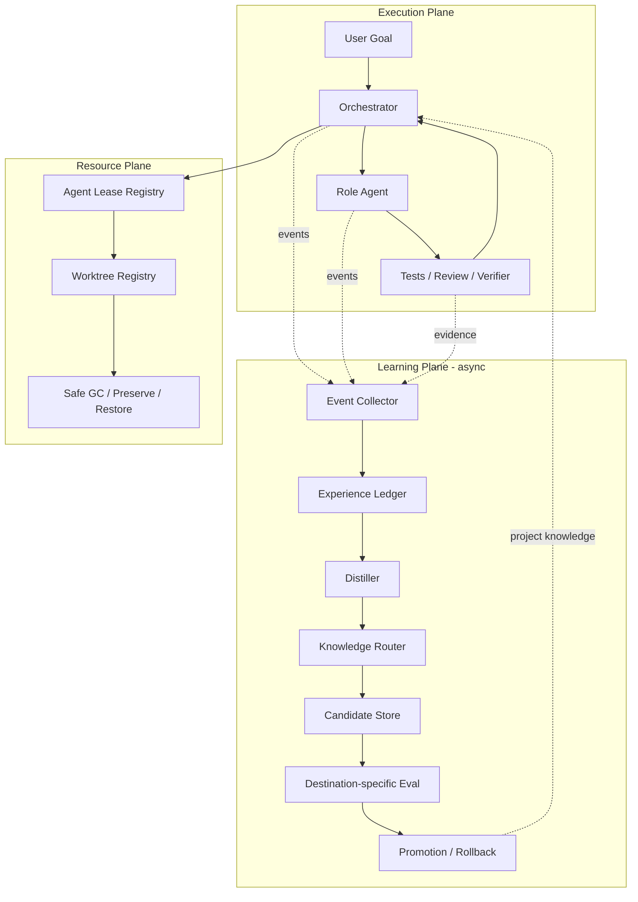
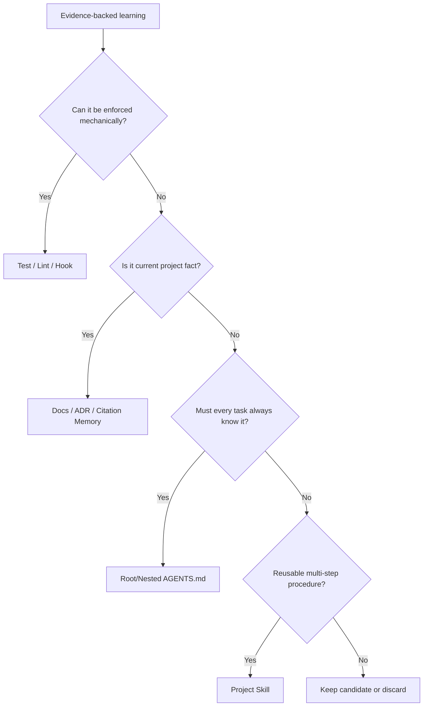
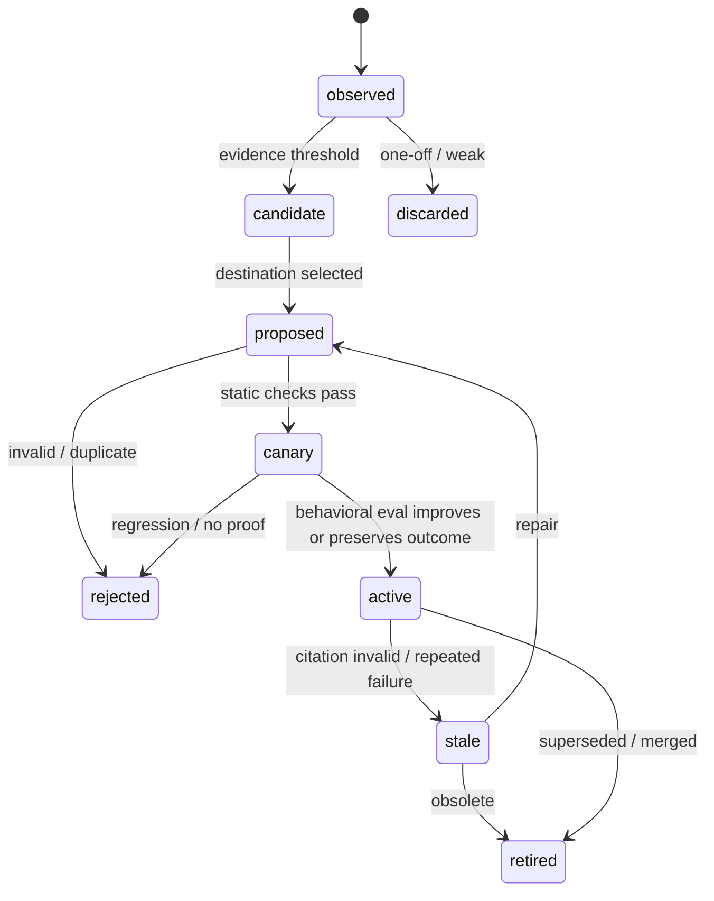
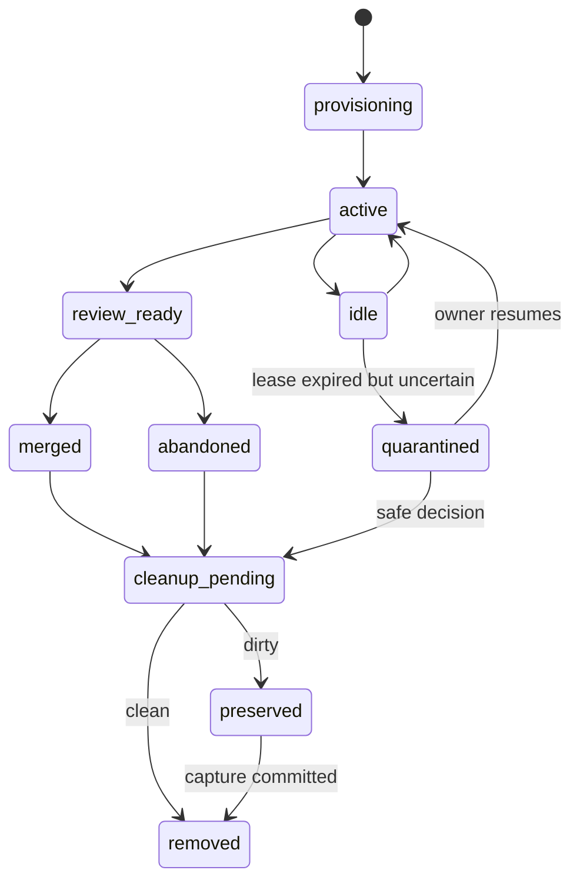

# Project Learning 与 Agent Lifecycle Deep Research

> 日期：2026-07-21
> 范围：项目级规则自动学习、项目 Skill 自动演进、多 Agent 上下文隔离、Worktree 生命周期管理
> 目标：减少人反复纠偏和搬运上下文，同时避免自动学习污染、流程膨胀和资源泄漏

## 1. Executive Summary

当前问题不是缺少一条更完整的开发工作流，而是缺少两类独立运行时：

1. **Project Learning Runtime**：从真实任务、用户纠正、Review、测试和交付结果中提取经验，判断应该进入代码约束、文档、`AGENTS.md` 还是项目 Skill，并经过验证后自动提升。
2. **Agent Resource Runtime**：管理 Agent session、Context Packet、Worktree、branch 和运行进程的所有权、租约、恢复与回收。

这两类能力不能只靠一个 `SKILL.md` 实现。Skill 可以定义语义判断，但无法可靠观察所有会话事件、持久维护状态、检测进程存活或保证异常退出后的资源回收。需要组合：

```text
deterministic runtime/hooks
  + append-only event ledger
  + narrow semantic curator
  + verifier/eval
  + Git-backed rollback
```
对当前 Adaptive suite 的建议不是继续聚合，而是重新划分职责：

```text
adaptive-dev-workflow   = 只处理新目标和实质性 reroute
workflow-control-plane  = 只处理需要恢复的复杂目标
project-learning        = 异步收集、提炼、验证、提升项目经验
agent-orchestration     = 角色、Context Packet、Agent lease 和并发预算
worktree-lifecycle      = Worktree registry、preserve、restore、safe GC
```

最重要的调研结论来自四类系统：

- **GitHub Copilot Memory**：项目事实不依赖离线“整理正确”，而是绑定代码引用，在使用时针对当前 branch 即时验证。
- **SkillClaw / AutoSkill / Acontext**：任务结束或反馈事件触发后台提炼，区分 update/create，并避免阻塞主任务。
- **EvoSkill / CODESKILL**：Skill 是否值得保留，必须由下游任务结果和 old/new eval 证明，而不是由 Skill 自己声称。
- **Agent Orchestrator / Sandcastle / Worktrunk**：Worktree 是有所有权和生命周期的资源；dirty worktree 必须 preserve，不能靠 `git worktree prune` 解决。

## 2. 用户真实痛点

### 2.1 Feedback Transfer Tax

用户当前承担了不应由人反复承担的“经验搬运”工作：

- 同一条开发偏好、禁区、质量要求需要在不同任务中重复说明。
- Agent 在一次任务中已经踩过的坑，换会话或换角色后重新踩一次。
- 用户需要自己判断某条经验应不应该写进 `AGENTS.md` 或项目 Skill。
- 多会话协作时，用户需要手工把 Spec、Design、Plan、Review 结论搬给下一个 Agent。

根因不是 Agent 没有记忆，而是没有一个明确的经验生命周期：

```text
Observation -> Evidence -> Attribution -> Destination -> Validation -> Promotion -> Revalidation
```

当前 `knowledge-promotion` 只覆盖了 Candidate，没有覆盖前面的自动观察，也没有覆盖后面的行为验证和自动应用。

### 2.2 Knowledge Placement Ambiguity

目前“记住这件事”可能被错误地理解成更新 `AGENTS.md`。实际上不同知识需要不同载体：

| 知识类型 | 正确载体 | 原因 |
| --- | --- | --- |
| 可机械判定的禁止项 | test / lint / hook | 比自然语言更可靠 |
| 当前架构和接口事实 | docs / ADR / code citation memory | 会随代码变化，需要校验 freshness |
| 所有任务都必须知道的少量规则 | root `AGENTS.md` | 始终加载，必须保持极短 |
| 仅某个目录适用的规则 | nested `AGENTS.md` | local delta，避免污染全局上下文 |
| 可按需复用的多步骤 SOP | project Skill | progressive disclosure |
| 某次任务的临时上下文 | workflow artifacts / event ledger | 不应永久提升 |

如果没有 Knowledge Router，自动学习只会把问题从“人重复解释”变成“Agent 自动制造规则垃圾”。

### 2.3 Success Is Not Evidence

Agent 不能从以下信号可靠推导“这是成功经验”：

- 用户没有继续反驳。
- 测试命令返回 0，但测试没有覆盖目标行为。
- Agent 自己声明任务完成。
- 某个 Skill 在一次任务中被调用。

因此学习信号必须区分：

```text
strong: explicit correction, accepted review, verifier pass, merged change
medium: repeated behavior with focused evidence
weak: agent self-assessment, silence, one-off success, LLM judge only
```

弱信号可以进入候选池，但不能直接改变未来 Agent 行为。

### 2.4 Branch and Time Drift

代码仓库知识不是静态知识：

- 某条规则可能只存在于未合并 branch。
- Review worktree 看到的是旧 commit。
- API、路径、测试命令会变化。
- 同一事实在两个并行 Worktree 中可能冲突。

简单的“90 天后降低 confidence”不能解决这个问题。一个 1 天前的未合并 branch 事实可能已经无效，一个 1 年前仍被测试覆盖的约束仍然有效。

正确策略是 **provenance + just-in-time verification**，而不是单纯按时间衰减。

### 2.5 Skill Poisoning and Self-Reinforcement

自动修改 Skill 存在反馈回路风险：

1. Agent 错误归因失败原因。
2. 错误规则写入 Skill。
3. 后续 Agent 因为读取 Skill 重复同样错误。
4. 新轨迹把该行为误认为“重复模式”，进一步强化错误规则。

所以 Skill 更新必须有外部证据、before/after、可回滚版本和部署后观察，不能只依赖同一个模型的 self-review。

### 2.6 Agent and Context Explosion

角色不等于 Agent 实例。如果为每个 Spec、Task、Review、Fix 都创建新 Agent，会出现：

- 大量重复读取相同仓库和文档。
- fork 全上下文时产生高 token 成本和上下文污染。
- 不 fork 时又需要人工搬运上下文。
- Session 和 Worktree 数量随 Task 数量线性增长。

正确抽象是：

```text
Role Template != Runtime Agent
Context Packet != Conversation History
Milestone Lease != Permanent Team Member
```

### 2.7 Worktree Has No Owner and No End

Helix 实测：

```text
registered worktrees: 224
branch worktrees:     180
detached worktrees:    44
git-prunable:            0
```

`0 prunable` 说明 Git 认为这些 Worktree 都是合法登记状态。问题不是文件系统残留，而是系统不知道：

- 哪个 workflow/task/agent 创建了它。
- Agent 是否仍然活跃。
- Review 是否结束。
- branch 是否已合并。
- dirty 内容是否需要保存。
- 何时可以安全删除。

因此仅增加一个定时执行 `git worktree prune` 的脚本无效。

## 3. Research Method

本次调研优先选择 2026 年仍在更新、具备源码或可验证架构说明的项目。研究方式包括：

- 阅读官方架构文章和论文。
- shallow clone GitHub 仓库并检查最新 commit。
- 阅读触发器、evolution pipeline、validator、version history、session lifecycle 和 Worktree cleanup 的实际代码。
- 对照当前 Adaptive suite 的 Skill、schema、eval report 和 Helix Worktree 数据。

重点源码：

- [SkillClaw workflow engine](https://github.com/AMAP-ML/SkillClaw/blob/main/evolve_server/engines/workflow.py)
- [SkillClaw evolution agent contract](https://github.com/AMAP-ML/SkillClaw/blob/main/evolve_server/engines/EVOLVE_AGENTS.md)
- [SkillClaw verifier](https://github.com/AMAP-ML/SkillClaw/blob/main/evolve_server/pipeline/skill_verifier.py)
- [EvoSkill improvement loop](https://github.com/sentient-agi/EvoSkill/blob/main/src/loop/runner.py)
- [EvoSkill Git program registry](https://github.com/sentient-agi/EvoSkill/blob/main/src/registry/manager.py)
- [Memento consolidation engine](https://github.com/Memento-Teams/Memento-Skills/blob/main/infra/memory/consolidation/engine.py)
- [Agent Orchestrator architecture](https://github.com/AgentWrapper/agent-orchestrator/blob/main/docs/architecture.md)
- [Agent Orchestrator session lifecycle](https://github.com/AgentWrapper/agent-orchestrator/blob/main/docs/plans/session-lifecycle-persistence.md)
- [Sandcastle Worktree resource lifecycle](https://github.com/mattpocock/sandcastle/blob/main/src/createWorktree.ts)
- [Compound Engineering ce-compound](https://github.com/EveryInc/compounding-engineering-plugin/blob/main/skills/ce-compound/SKILL.md)

## 4. Detailed Implementation Review

## 4.1 GitHub Copilot Cross-Agent Memory

GitHub 在 2026 年公开的 memory 设计最接近“项目事实如何自动学习且不腐烂”。它的关键判断是：memory 最难的问题不是 retrieval，而是代码变化后事实是否仍然成立。

### 机制

Agent 通过工具调用写入：

```json
{
  "subject": "API version synchronization",
  "fact": "SDK、server 和 docs 的 API version 必须同步",
  "citations": [
    "src/client/sdk/constants.ts:12",
    "server/routes/api.go:8",
    "docs/api-reference.md:37"
  ],
  "reason": "版本不一致会破坏集成"
}
```

Memory 被下一次任务检索出来后，不直接信任，而是先读取 citation：

- citation 仍存在并支持事实：使用并刷新。
- citation 失效或代码矛盾：拒绝旧事实并写入修正版。
- branch 不相关：不应用。

### 为什么有效

- 把“复杂的离线全局整理”转化成“少量便宜的读取验证”。
- 避免未合并 branch、旧 commit 和冲突观察污染当前任务。
- 不要求维护一个完美、永远最新的中心知识库。
- 让 Coding Agent、Review Agent 和 CLI 共享项目事实。

GitHub 还做了 adversarial memory 测试，并报告 memory 使 code review precision/recall 和 Coding Agent PR merge rate得到统计改善。[官方设计与实验](https://github.blog/ai-and-ml/github-copilot/building-an-agentic-memory-system-for-github-copilot/)

### 对本项目的启发

项目事实必须携带：

```text
repo / branch / observed_commit / path / symbol-or-anchor / content_hash
```

“过期”应主要由引用验证决定，时间只用于排序和触发重新检查。

### 不足

- 它主要保存 fact，不解决多步骤 SOP 如何形成项目 Skill。
- 公开实现不是可直接嵌入的开源 runtime。
- 当前设计偏 repository memory，不直接维护 `AGENTS.md` 和 docs。

## 4.2 SkillClaw

SkillClaw 是本次调研中自动 Skill evolution 工程链路最完整的开源实现。

本地检查版本：`bf4dc2e`，2026-06-02。

### 机制

```text
Agent traffic
  -> local proxy intercept
  -> session artifact
  -> shared/local storage
  -> Summarize
  -> optional Session Judge
  -> Aggregate by actually referenced skill
  -> improve/create/skip
  -> Skill Verifier
  -> validation queue
  -> publish/version history
```

关键设计：

1. Client Proxy 负责观察，不要求每个 Coding Agent 主动记日志。
2. Evolve Server 在后台处理，不阻塞原任务。
3. 只把实际 read/modified 的 Skill 计为 referenced，避免“Skill catalog 出现在 prompt”被误判为使用。
4. 失败归因区分 Skill 问题、Agent 误用和环境问题。
5. 证据弱时优先 `skip`，而不是为了学习而修改。
6. 更新前读取完整 version history 和 evidence。
7. 支持 candidate validation job，满足结果数、approval 数和平均分阈值后才 publish。
8. Dashboard 展示 session trace、validation、版本历史，并提供 `doctor` / `restore`。

### 为什么有效

- 把观察层和演化层解耦，符合“主任务优先、学习异步”。
- 更新决策基于多条 session 聚合，不只看一次对话。
- Skill 的变更有来源 session、版本历史和验证状态。
- 可以跨 Agent/设备共享同一 Skill library。

[SkillClaw 官方仓库](https://github.com/AMAP-ML/SkillClaw)

### 不足

- 需要 proxy、storage、可选 Nacos/OSS/S3 和 evolve server，对单机 Codex 项目偏重。
- Session Judge 和 Skill Verifier 仍主要是 LLM 评分，存在同源偏差。
- Replay cases 可能来自促成该修改的相同 session，不是真正 holdout。
- 它的目标只有 Skill library，不能判断经验更适合 test、docs、ADR 或 `AGENTS.md`。
- 跨团队共享可能把项目局部偏好错误扩散为团队通用 Skill。

### 应借鉴

- observer/evolver 分离。
- referenced-skill attribution。
- `skip` 是一等决策。
- version + evidence history。
- candidate 与 active 分离。
- validation threshold 和 restore。

### 不应照搬

- API proxy 和远端共享存储作为第一版前提。
- 所有知识统一写成 Skill。
- 只使用 LLM judge 决定发布。

## 4.3 AutoSkill

AutoSkill 的研究框架支持从经验中自动 add/merge/update Skill，并用版本号表达后续反馈对 Skill 的修订。2026-05 新增的本地 `autoskill` manager 则更偏安全、可 Review 的个人 Skill 管理。

### 设计亮点

- `discard / keep_note / improve / merge / create` 是明确生命周期。
- 按 task family、trigger、tools、failure mode、output contract 去重，不按字符串去重。
- 区分 correction、preference、best practice、knowledge gap 和 one-off result。
- 要求 strong/medium/weak evidence，禁止从“用户没反对”推断偏好。
- Similar Skill Search 在 create 之前执行。
- 主任务优先，maintenance debounce，单次只处理一个高价值候选。

[AutoSkill 官方仓库](https://github.com/ECNU-ICALK/AutoSkill)

### 不足

- 本地 manager 本质是一个超过 700 行的 Prompt/Skill，不是真正事件运行时。
- “每个 substantive turn 静默扫描”依赖模型遵循，无法保证异常退出和跨会话触发。
- 每次文件写入都要求用户批准，与“减少用户判断频率”的目标冲突。
- 仍把多数可复用经验引向 Skill，没有完整 Knowledge Router。

### 应借鉴

- extraction boundary。
- evidence level 和 recurrence。
- improve/merge 优先于 create。
- 一次只改变一个 behavioral lever。

## 4.4 Acontext

Acontext 把 Skill 直接作为可检查的 memory layer：任务 complete/failed 后执行 distillation，由 Skill Agent 决定更新现有 Skill 或创建新 Skill，生产模式后台运行。[Acontext](https://github.com/memodb-io/Acontext)

### 设计亮点

- Task outcome 是学习边界，不是每个 turn 都学习。
- Memory 是普通 Markdown Skill，可读、可编辑、可迁移。
- `list_skills/get_skill/get_skill_file` 做 progressive disclosure，而不是把所有 memory 注入 prompt。
- Agent 不等待后台学习完成。

### 不足

- 自托管架构包含 PostgreSQL、S3、Redis、RabbitMQ，远超过本地项目需要。
- 公开说明未展示与 EvoSkill 同等级的 old/new downstream verifier。
- 把 memory 和 Skill 近似等同，仍然缺少 test/docs/AGENTS 的目的地选择。

## 4.5 Memento-Skills

Memento 的核心是 `Read -> Execute -> Reflect -> Write`，并在 2026 年把 memory/context 基础设施从 Agent core 中拆出。

本地检查版本：`e7687d9`，2026-06-12。

### 代码级亮点

- 新 session 先写入 staging，不立即改长期 memory。
- 达到 session count 或 byte threshold 后才 consolidate。
- quick/deep 两种 consolidation，避免每次都全量读取。
- 文件锁防止多个后台 consolidation 并发写。
- Dream loop 与 Agent 主循环分离。

[Memento-Skills](https://github.com/Memento-Teams/Memento-Skills)

### 不足

- `ResultApplier` 会直接按 LLM JSON 更新、创建或删除 topic 文件，缺少强 citation/verifier gate。
- 时间/体积 Gate 解决“何时整理”，没有解决“经验是否真实”。
- 长期 Agent profile、用户偏好和项目事实容易混在同一个 memory 概念中。

### 应借鉴

- staging buffer。
- threshold/debounce。
- quick/deep 分层。
- lock 和后台失败不影响主任务。

## 4.6 Letta Code

Letta Code 使用长期 Agent、Git-backed MemFS、background dreaming、memory doctor 和 project/agent/global 多级 Skill。[Letta Code](https://github.com/letta-ai/letta-code)

### 设计亮点

- 所有 memory mutation 由 Git 记录，可回看和同步。
- `/doctor` 把 memory quality audit 做成产品能力。
- Agent memory 与 project skill 有不同 scope。
- 支持后台反思，不需要用户每次提醒。

### 不足

- 长期 mutable Agent identity 容易把个人偏好、项目事实和会话经验混合。
- 长期 Agent 本身可能积累错误上下文，不能替代 repository-grounded truth。
- 对当前 Codex skill suite 来说，完整采用 Letta runtime 代价太大。

## 4.7 EvoSkill

EvoSkill 是“是否真的提高下游结果”方面最值得借鉴的实现。

本地检查版本：2026-07 当前仓库。

### 机制

```text
baseline evaluation
  -> collect failures
  -> proposer chooses edit/create
  -> generate candidate Skill
  -> commit candidate on program/* Git branch
  -> evaluate candidate on validation set
  -> improved candidate joins frontier
  -> otherwise discard
  -> stop after no-improvement limit
```

每轮报告记录：baseline、final score、Skill score delta、保留数量、迭代和成本。[EvoSkill](https://github.com/sentient-agi/EvoSkill)

### 为什么有效

- Skill 的价值由 frozen downstream agent 的任务表现决定。
- Candidate 与 baseline 可复现对比。
- Git branch 提供隔离、lineage 和 rollback。
- 无提升时停止，避免无限 self-improvement。

### 不足

- 偏 benchmark/offline optimization，需要 ground truth/validation set。
- 成本高，不适合每次开发任务结束都运行。
- Validation set 可能被反复迭代过拟合。
- 每个 program 使用 Git branch，如果缺少 GC 仍会制造 branch/worktree 膨胀。

### 应借鉴

- Candidate 不直接 active。
- before/after outcome delta。
- holdout eval。
- no-improvement stop。
- mutation lineage 和 rollback。

## 4.8 CODESKILL 与 Socratic-SWE

CODESKILL 把 Skill extraction/maintenance 视为可学习 policy，并使用 rubric feedback 加 downstream execution reward。论文报告相对 no-skill baseline 平均 pass rate 提升 9.69，同时 Skill bank 在迭代中保持稳定规模。[CODESKILL](https://arxiv.org/abs/2605.25430)

Socratic-SWE 从历史 coding trace 中提炼 recurring failure 和 repair pattern，再用 Skill 指导生成针对性 repair task，形成训练闭环。[Socratic-SWE](https://arxiv.org/abs/2606.07412)

### 对工程设计的意义

- “Skill 写得像不像专家”不是最终指标，下游 task outcome 才是。
- Skill bank 需要 size pressure，不能只增不减。
- 失败轨迹和成功轨迹都要用，但必须抽象为 transferable procedure。
- 当前项目不需要实现 RL，但应保留 outcome-based promotion 接口。

## 4.9 Compound Engineering

`ce-compound` 专注把已经解决并验证的问题沉淀为一份 `docs/solutions/...`，而不是自动改全局规则。

本地检查版本：`11e3d46`，2026-07-20。

### 设计亮点

- 每次只沉淀一个 learning。
- Lightweight 不启动 subagent；Full 才进行多源研究。
- Session history 先做便宜 metadata probe，命中相关性才深读。
- Subagent 只写 scratch artifact，orchestrator 写最终 tracked doc。
- 代码行为声明必须回到当前源码验证。
- 修改 `AGENTS.md/CLAUDE.md` 的权限高于写 solution doc；headless 只报告 gap。
- 确定性 frontmatter/claim validator 与语义 review 分开。

[Compound Engineering](https://github.com/EveryInc/compounding-engineering-plugin)

### 不足

- Full mode仍较重，默认多个 research/review agent。
- 主要产出 solution docs，不自动构建项目 SOP Skill。
- 依赖自然语言 Auto-Invoke，不能取代 runtime event hook。

### 应借鉴

- One learning per run。
- cheap probe before deep extraction。
- verified solution 才可沉淀。
- Instruction file 是高权限目的地。
- Lightweight/headless 不阻塞。

## 4.10 OpenAI Harness Engineering

OpenAI 的生产经验明确否定“大 AGENTS.md”：短 `AGENTS.md` 只作为地图，结构化 docs 才是 system of record；lint/CI 验证结构和 freshness；周期性 doc-gardening Agent 修复过期文档。[Harness Engineering](https://openai.com/index/harness-engineering/)

### 对本项目的意义

- 自动学习不是把所有经验写进 `AGENTS.md`。
- AGENTS 只保留高价值入口、禁令和导航。
- 可机械执行的经验必须转为 lint/test。
- 必须有知识垃圾回收，不允许只追加。

## 4.11 OpenSite Skills

本地检查版本：`535b3a8`，2026-07-11。

### 设计亮点

- Root + nested `AGENTS.md`，子级只写 local delta。
- 只有 distinct invariant/workflow/validator 或反复出错的目录才建立 nested 文件。
- Memory 分 episodic、semantic、procedural、working。
- 写入前去重，周期 consolidation、archive 和 index rebuild。

[OpenSite Skills](https://github.com/opensite-ai/opensite-skills)

### 不足

- 每次 session end 都写 summary，容易产生噪音。
- 基于固定天数的 confidence decay 不足以判断代码事实是否过期。
- Memory store 与 repository truth 分离，规则 promotion 仍依赖 Agent 判断。

## 4.12 Agent Orchestrator

Agent Orchestrator 是 Worktree 生命周期方面最完整的生产级参考。

本地检查版本：`be260b0`，2026-07-21。

### 设计亮点

1. 持久层只存 durable facts，display status 在读取时派生。
2. Session termination 需要多信号：runtime/process 明确死亡、无近期活动、无 PR ownership。
3. probe 失败不是死亡证据。
4. 永不直接删除 dirty worktree。
5. App shutdown 时先 capture uncommitted work，再 destroy。
6. 未提交内容写成 Git commit object，并由稳定 ref `refs/ao/preserved/<session-id>` 指向。
7. DB 写入 preserve ref 成功后才允许 force-remove，满足 crash safety。
8. Restore 时重建 Worktree、应用 preserved commit，再恢复 Agent session。

[Agent Orchestrator](https://github.com/AgentWrapper/agent-orchestrator)

### 为什么适合解决 Helix 问题

Helix 的 224 个 Worktree 需要的不是“更激进删除”，而是：

- Session/Task/Worktree 显式关联。
- 多信号派生状态。
- dirty 内容可恢复保存。
- capture-before-destroy 原子顺序。
- cleanup 结果和 skip 原因可观察。

### 不足

- 完整 daemon、SQLite、dashboard 和 plugin architecture 对当前 Skill suite 过重。
- 每个 issue 一个 Agent/Worktree 的 fleet 模型不适合普通单会话、小任务开发。

### 应借鉴

- durable facts + derived state。
- conservative termination。
- preserved Git ref。
- cleanup skip report。
- crash-safe ordering。

## 4.13 Sandcastle 与 Worktrunk

Sandcastle 使用 `await using` / `Symbol.asyncDispose` 把 Worktree 变成作用域资源：作用域结束自动 close；clean 时删除，dirty 时保留并返回路径。[Sandcastle](https://github.com/mattpocock/sandcastle)

Worktrunk 提供 `switch/list/merge/remove`，展示 dirty、ahead/behind、unpushed、age、CI/PR，并支持生命周期 Hook。[Worktrunk](https://github.com/max-sixty/worktrunk)

### 组合启发

- Sandcastle 提供正确的默认资源语义：cleanup default，retain explicit。
- Worktrunk 提供人和 Agent 都能理解的可观测状态。
- Agent Orchestrator 提供跨 session 的持久恢复和 crash safety。

## 5. Comparative Scorecard

| 系统 | 自动观察 | 异步 | 归因 | 去重/合并 | 强结果验证 | 版本回滚 | 多目的地 | Branch freshness | Worktree lifecycle |
| --- | --- | --- | --- | --- | --- | --- | --- | --- | --- |
| GitHub Memory | 是 | 是 | 中 | 中 | 引用验证 + A/B | 修正版本 | 仅 memory | 强 | 否 |
| SkillClaw | Proxy | 是 | 强 | 强 | 中，LLM + replay | 强 | 仅 Skill | 弱 | 否 |
| AutoSkill | 模型扫描 | 伪异步 | 中 | 强 | 中 | VCS 建议 | 主要 Skill | 弱 | 否 |
| Acontext | Session | 是 | 中 | update/create | 未充分公开 | 可导出 | 仅 Skill | 弱 | 否 |
| Memento | Staging | 是 | 弱 | topic consolidation | 弱 | 文件级 | memory/Skill | 弱 | 否 |
| EvoSkill | Eval trace | 离线 | 强 | edit/create | 强，outcome delta | Git lineage | Skill/prompt | N/A | branch GC 弱 |
| Compound | 解决后触发 | 可 headless | 强 | overlap | 强 grounding | Git | docs/少量 AGENTS | 源码验证 | 否 |
| OpenAI Harness | Repo events | 周期 | 中 | doc gardening | lint/CI | Git | docs/AGENTS/test | 强 | 否 |
| Agent Orchestrator | Runtime event | 是 | N/A | N/A | 生命周期 invariant | preserve ref | runtime state | branch-aware | 强 |
| Sandcastle | Scope exit | 同步 | N/A | N/A | dirty check | preserve path | N/A | branch-aware | 中 |

没有单一项目覆盖全部需求。最佳方案必须组合，而不是选择其中一个完整框架。

## 6. Proposed Architecture

## 6.1 Three Planes



Execution Plane 不等待 Learning Plane。Learning Plane 失败只记录 maintenance error，不阻塞用户目标。

## 6.2 Event Collector

Collector 只负责记录事实，不做语义 promotion。

建议事件：

```text
user_correction
user_preference
review_finding
review_accepted
validator_result
escaped_defect
task_completed
task_abandoned
skill_loaded
skill_not_loaded
skill_result
context_expansion
agent_spawned
agent_closed
worktree_created
worktree_dirty
worktree_merged
worktree_removed
```

Canonical event：

```json
{
  "event_id": "EV-...",
  "type": "user_correction",
  "project_id": "helix",
  "workflow_id": "WF-...",
  "task_id": "T-...",
  "session_id": "S-...",
  "agent_role": "implementer",
  "repo_head": "<sha>",
  "branch": "feature/x",
  "skill_refs": ["project-import-article"],
  "summary": "Review worktree 不应在结束后永久保留",
  "evidence_refs": ["conversation:...", "git:..."],
  "sensitivity": "project",
  "created_at": "..."
}
```

Raw event ledger 默认 gitignored，因为它可能包含对话片段和本地路径。被提升的 artifact 才进入 Git。

## 6.3 Trigger Policy

不要每个 turn 都启动 Learning Agent。使用两级触发：

### Cheap deterministic trigger

- 明确用户纠正或 future-oriented instruction。
- Review finding 被接受。
- Verifier 从 fail 变 pass。
- 同一 `pattern_key` 在不同 task 再次出现。
- Workflow close / milestone close。
- Skill 被调用后产生 escaped defect。

### Semantic distillation trigger

满足任一条件才运行：

- 强信号 1 条。
- 中信号跨两个 task 重复。
- staging 达到事件数/字节阈值。
- 用户直接要求“以后这样做”。
- 周期 maintenance 扫描发现 stale/contradictory candidate。

同一 workflow 最多一个后台 distillation job；后续事件 coalesce。

## 6.4 Attribution

每次失败先判断原因，禁止默认归因到 Skill：

```text
requirement_gap
project_fact_stale
skill_missing
skill_wrong
skill_not_triggered
skill_misused
agent_context_overflow
agent_execution_error
environment_failure
verifier_gap
resource_lifecycle_failure
```

只有 `skill_missing / skill_wrong / skill_not_triggered` 可以直接进入 Skill candidate。

## 6.5 Knowledge Router



### Destination rules

**Test/Lint/Hook**

- 输入和违规行为可机器识别。
- 例如“这三个 version 文件必须同步”应优先写 consistency test，而不是只写 AGENTS。

**Docs/ADR/Citation Memory**

- 描述 current truth、架构 rationale、接口或已验证坑点。
- 每条事实绑定 code citations 和 observed commit。

**AGENTS.md**

- 强制 always-loaded。
- 只允许稳定、高影响、非显然、无法完全机械执行的规则。
- Root 保持地图；目录局部规则写 nested AGENTS，且只写 parent delta。
- 每次写入必须检查 line/token budget 和重复规则。

**Project Skill**

- 有明确 trigger、输入、输出、步骤和 validator。
- 是可跨任务复用的 procedure，而不是一次 postmortem。
- 默认 project scope，不自动提升为 global Skill。

## 6.6 Candidate State Machine



Candidate 不进入正常 Agent context。只有 active artifact 能被默认检索。

## 6.7 Autonomy Policy

为了减少用户判断频率，同时避免静默污染，使用风险分层：

| Level | 行为 | 是否自动 |
| --- | --- | --- |
| A0 | 写 raw event / staging | 自动 |
| A1 | 创建候选、去重、生成 proposed diff/eval | 自动、后台 |
| A2 | 更新低风险项目 docs、nested AGENTS、project Skill | Gate 通过后自动 commit，里程碑汇报 |
| A3 | 全局 Skill、root policy、安全/权限/数据/API 规则 | 生成 proposal，需人批准 |

A2 自动生效的必要条件：

- project-local。
- 不涉及 secret、安全边界、公共 API 或生产操作。
- 有 strong evidence 或跨 task recurrence。
- destination-specific validator 通过。
- 变更是小 diff，未删除用户规则。
- 有独立 Git commit，可以一键 revert。

这比 AutoSkill 的“所有写入都问一次”更符合低干预目标，也比 SkillClaw 的“所有经验直接进 Skill pipeline”更安全。

## 6.8 Citation and Freshness Contract

```json
{
  "claim": "import pipeline 的 stage output 必须绑定 current_generation",
  "scope": "src/import/**",
  "observed_commit": "abc123",
  "observed_branch": "main",
  "citations": [
    {
      "path": "src/import/stage_contract.py",
      "symbol": "StageOutput",
      "content_hash": "sha256:..."
    }
  ],
  "last_verified_commit": "abc123",
  "status": "active"
}
```

使用时：

1. 当前 branch 能否看到 citation。
2. symbol/anchor 是否仍存在。
3. content hash 变化后，当前代码是否仍支持 claim。
4. 若不支持，将 memory 标 stale，不把它当指令执行。

## 6.9 Destination-specific Validation

### AGENTS change

- 路径和命令存在。
- 与 parent/nested instructions 不冲突。
- should-follow / should-not-follow sandbox cases。
- line/token budget 不增加失控。
- 删除该规则后，相关失败 case 应复现或风险上升。

### Project Skill change

- static validation。
- trigger positive/near-miss negative。
- old/new replay。
- 至少一个 holdout case。
- verifier pass rate 不下降。
- token/time 增量在预算内。
- 后续 N 次真实使用监控 false activation 和 escaped defect。

### Test/Lint change

- 在目标违规 fixture 上失败。
- 在当前正确代码上通过。
- 不制造高频 flaky/blocking cost。

### Docs/Fact change

- citations 在当前 branch 可验证。
- 与代码和已批准 ADR 不冲突。
- freshness metadata 更新。

## 6.10 Skill Performance Feedback

Skill 的一次使用记录：

```json
{
  "skill": "project-import-article",
  "version": 3,
  "triggered": true,
  "task_family": "article-import",
  "verifier_status": "pass",
  "review_findings": 1,
  "escaped_defect": false,
  "token_cost": 12000,
  "wall_time_ms": 180000
}
```

滚动指标：

- trigger precision / recall。
- verifier pass rate。
- correction recurrence。
- completion overclaim。
- escaped defect。
- token/time overhead。

连续两次 Skill 相关失败不应直接阻塞目标。运行时先回退到不依赖该 Skill 的路径继续任务，同时把 Skill 标为 suspect 并创建 repair candidate。

## 7. Agent Orchestration Design

## 7.1 Fixed Team Is the Wrong Default

固定四个长期 Agent 看似节省创建成本，但会积累：

- 旧任务上下文。
- 已失效的 branch 事实。
- 不同角色间隐性污染。
- 长期 session 的 compaction 偏差。

更合适的是 **固定角色模板 + 有预算的短期 carrier**：

```text
roles: spec_writer, design_reviewer, implementer, code_reviewer, verifier
active carriers: default max 4
carrier reuse: only within one cohesive milestone
fresh reviewer: clean context packet, no implementation chat
```

“4”是并发上限，不是永久团队人数。

## 7.2 Context Isolation

Orchestrator 只发送：

```json
{
  "objective": "Review technical design",
  "artifact_refs": ["spec", "design"],
  "allowed_paths": ["src/import/**", "tests/import/**"],
  "acceptance_refs": ["AC-1", "AC-2"],
  "known_decisions": ["ADR-12"],
  "explicit_omissions": ["implementation chat", "unrelated modules"],
  "expected_result": "review_result.json"
}
```

不发送整段聊天。默认创建 clean-context carrier；只有同一 milestone 的连续实现才复用 Agent。

## 7.3 Agent Lease

```json
{
  "agent_lease_id": "AL-001",
  "workflow_id": "WF-001",
  "task_id": "T-004",
  "role": "code_reviewer",
  "carrier": "subagent",
  "context_packet_hash": "sha256:...",
  "worktree_id": "WT-010",
  "state": "active",
  "created_at": "...",
  "last_heartbeat": "...",
  "expires_at": "..."
}
```

结束条件：result accepted、task cancelled、heartbeat timeout 且多信号确认 inactive。Agent lease 结束会触发 Worktree lifecycle，而不是仅把 Agent session 标 completed。

## 7.4 Spawn Budget

- L0/L1：默认 0 subagent。
- 连续低风险 batch：主 session 或一个 implementer carrier。
- Spec/Design：只有边界不确定或高风险时 maker/checker。
- Review：一个 fresh reviewer，不自动创建 fixer + rereviewer 链。
- 并行：只有任务无共享写状态且 wall-clock 收益明确。
- 同一 milestone 默认最多 4 个 active carriers、1 个 reviewer、1 个 verifier。

## 8. Worktree Lifecycle Design

## 8.1 Registry

Worktree 创建必须登记：

```json
{
  "worktree_id": "WT-010",
  "project_id": "helix",
  "path": "...",
  "branch": "review/import-contract-v5",
  "head": "abc123",
  "workflow_id": "WF-001",
  "task_id": "T-004",
  "agent_lease_id": "AL-001",
  "purpose": "design_review",
  "state": "active",
  "created_at": "...",
  "last_heartbeat": "...",
  "pr_ref": null,
  "preserved_ref": null
}
```

第一版可用 SQLite 或 append-only JSONL；不能只从目录名反推所有权。

## 8.2 State Machine



## 8.3 Derived Liveness

不能因为一次 probe 失败就判断 Agent 死亡。需要组合：

- Agent lease heartbeat。
- runtime/process status。
- 最近文件/terminal activity。
- workflow/task state。
- open PR/review ownership。
- dirty/ahead/unpushed Git facts。

状态由这些事实派生，避免多个状态字段互相矛盾。

## 8.4 Cleanup Policy

| 情况 | 动作 |
| --- | --- |
| clean + merged + no active lease | 立即 remove |
| clean + abandoned + retention expired | remove |
| dirty + active owner | 保留 |
| dirty + terminal owner | capture to preserve ref，再 remove |
| unmerged commits + unknown owner | quarantine，禁止自动删除 |
| detached review + same HEAD + accepted result | remove |
| probe error only | 不删除 |

默认 retention：

- completed reviewer scratch：0-24h。
- merged implementation：0-72h。
- abandoned but clean：72h。
- uncertain/dirty/unmerged：不按时间强删，进入 quarantine。

## 8.5 Capture-before-destroy

借鉴 Agent Orchestrator：

```text
1. inspect dirty/untracked/ahead state
2. create temporary Git tree/commit without mutating user index
3. write refs/adaptive/preserved/<worktree-id>
4. persist preserved_ref in registry
5. close runtime
6. force-remove worktree
7. on restore, recreate worktree and apply preserved commit
8. delete preserve ref only after successful apply
```

关键不变量：registry commit 必须发生在 remove 之前。

## 8.6 Existing Helix Migration

第一次不自动删除。先执行 inventory：

```text
active process/session
dirty working tree
untracked files
ahead commits
branch merged status
PR status
duplicate detached review at same HEAD
directory age
owner inferability
```

分类：

```text
SAFE_REMOVE
PRESERVE_THEN_REMOVE
ACTIVE
QUARANTINE_UNKNOWN
```

生成 dry-run report，由用户只 Review `QUARANTINE_UNKNOWN` 和 destructive boundary；之后新创建 Worktree 才完全自动走 registry。

## 9. Integration With Current Adaptive Suite

## 9.1 Keep

- `adaptive-dev-workflow` 的 task facts 和 route boundary。
- `workflow-control-plane` 的可恢复 manifest 和 verifier-signed claim。
- `agent-orchestration` 的 role/context packet contract。
- `change-aware-testing` 的测试成本控制。
- `delivery-verification` 的 evidence trust model。

## 9.2 Change

### `knowledge-promotion`

当前只有 candidate capture，应拆成：

```text
project-learning-runtime/
  hooks/ or collector adapters
  schemas/event.schema.json
  schemas/candidate.schema.json
  scripts/record_event.py
  scripts/distill_candidates.py
  scripts/verify_citations.py
  scripts/promote_candidate.py
  scripts/consolidate_learning.py

knowledge-promotion/
  only semantic destination and promotion policy
```

### `project-harness-init`

只初始化最小学习配置、目录和 policy，不预先创建大量空 Skill/docs。

### `agent-orchestration`

增加：

- agent lease schema。
- concurrency/spawn budget。
- carrier reuse policy。
- close result 到 Worktree lifecycle 的 transition。

### 新增 `worktree-lifecycle`

这是资源管理 Skill + deterministic scripts，不属于 Adaptive Router。

## 9.3 Remove or Avoid

- 每个 Task 自动 learning capture。
- 每个 session 强制 summary。
- 每次 correction 都立即改 AGENTS。
- 每个角色都创建 Agent。
- 每个 reviewer 都创建独立永久 Worktree。
- 只按天数衰减项目事实。
- 用 LLM 自评作为唯一 publish gate。
- 用 `git worktree prune` 代替 lifecycle。

## 10. Why This Solves the Pain

| 痛点 | 机制 | 为什么能解决 |
| --- | --- | --- |
| 反复告诉 Agent 同一规则 | Event Collector + recurrence + auto A2 promotion | 用户纠正被持久记录并进入正确载体 |
| 不知道写 AGENTS 还是 Skill | Knowledge Router | 目的地由可执行性、scope、加载频率决定 |
| 怕自动学习写错 | Candidate/canary/active + external evidence + Git rollback | 错误候选不会直接污染正常 context |
| 项目事实容易过期 | Citation + current-branch JIT verification | 使用时验证，不依赖主观 freshness |
| Skill 越积越多 | merge-first + size pressure + outcome eval + retire | 只有带来下游增益的 Skill 保留 |
| 学习过程拖慢开发 | async sidecar + debounce + cheap trigger | 主任务不等待反思和 eval |
| Subagent 几百个 | role template + spawn budget + milestone lease | 角色和实例解耦，限制活跃 carrier |
| Fork context 太贵 | clean carrier + explicit Context Packet | 不复制整段历史，只发送任务所需 artifact |
| Worktree 无法安全清理 | registry + derived liveness + preserve ref | 能判断 owner/state，并保证 dirty 内容可恢复 |
| 目标模式因失败阻塞 | Skill suspect/fallback，而不是 workflow block | 学习修复与目标执行解耦 |

## 11. Phased Implementation

## Phase 0: Observe Only

目标：先证明能采集正确事件，不修改任何规则。

- Event schema + append-only ledger。
- Workflow close、user correction、review、validator、skill use 事件。
- Worktree inventory 和 registry bootstrap。
- Dashboard/report 只读。

验收：连续三个真实任务中，关键纠正、Skill 使用、验证结果、Agent/Worktree 所有权可追踪，主任务 token/time 增量低于 3%。

## Phase 1: Candidate and Routing

- Distiller + attribution taxonomy。
- Knowledge Router。
- Candidate dedupe/merge。
- Citation memory 和 JIT validator。
- 不自动修改 active AGENTS/Skill。

验收：人工抽查候选目的地 precision >= 90%，one-off promotion = 0。

## Phase 2: Low-risk Auto Promotion

- A2 project-local auto commit。
- nested AGENTS 和 project Skill validator。
- old/new replay + holdout。
- automatic revert path。

验收：completion overclaim = 0；错误 promotion < 5%；用户重复纠正频率下降；无显著 L0/L1 开销。

## Phase 3: Agent and Worktree Runtime

- Agent lease + spawn budget。
- Worktree registry + heartbeat。
- safe cleanup + quarantine report。
- preserve ref + restore。

验收：新任务 Worktree owner coverage = 100%；终态 clean Worktree 自动回收 >= 95%；dirty data loss = 0。

## Phase 4: Continuous Outcome Optimization

- Skill usage telemetry。
- baseline/candidate frontier。
- periodic holdout eval。
- stale/duplicate/low-value Skill retirement。

验收：使用学习系统后的 verifier pass、返工和人工纠偏优于 without-learning baseline，成本增量在预算内。

## 12. Eval Plan

必须对照：

```text
without learning runtime
current candidate-only knowledge-promotion
new learning runtime
```

### Learning metrics

- Correction capture recall。
- Candidate precision。
- Destination accuracy。
- False promotion rate。
- Duplicate Skill rate。
- Stale fact rejection rate。
- User repeated-correction rate。
- Skill outcome delta。
- Learning overhead tokens/time。

### Worktree metrics

- Owner coverage。
- Active false-positive cleanup = 0。
- Dirty data loss = 0。
- Terminal clean cleanup rate。
- Orphan/quarantine count。
- Average Worktree lifetime。
- Restore success rate。

### Adversarial cases

- 用户临时要求被误写为永久规则。
- 未合并 branch 事实与 main 冲突。
- Skill 已有正确规则，但 Agent 没加载。
- 环境故障被误归因为 Skill。
- LLM judge 给错误候选高分。
- dirty Worktree owner heartbeat 丢失。
- reviewer detached Worktree 与多个同 HEAD 副本。
- preserve 成功但 registry 写入失败。
- registry 写入成功但 remove 前进程崩溃。

## 13. Final Recommendation

不建议现在继续扩写 `adaptive-dev-workflow`，也不建议直接安装完整 SkillClaw、Letta 或 Agent Orchestrator。

推荐的最小正确方向是：

1. 先实现 project-local、append-only 的 Event Collector 和 Worktree inventory。
2. 将 `knowledge-promotion` 改为带 attribution、Knowledge Router 和 candidate state 的后台 curator。
3. 使用 GitHub Memory 式 citation + JIT verification 管 current project facts。
4. 使用 EvoSkill 式 old/new outcome eval 管 Skill promotion。
5. 使用 SkillClaw 式 version/evidence history 和 `skip` 决策。
6. 使用 Agent Orchestrator 式 durable facts、capture-before-destroy 和 restore 管 Worktree。
7. Agent 角色保持固定，Agent 实例按 milestone 临时租用，并设置 max-active budget；不采用四个永久长上下文 Agent。

最终系统不是更大的 SDD，而是一个轻量、可审计的项目学习与资源运行时：

```text
Agent executes
  -> runtime records facts
  -> background curator proposes the smallest durable improvement
  -> verifier proves or rejects it
  -> Git makes it reversible
  -> the next agent verifies project facts before reuse
  -> terminal resources are reclaimed safely
```
